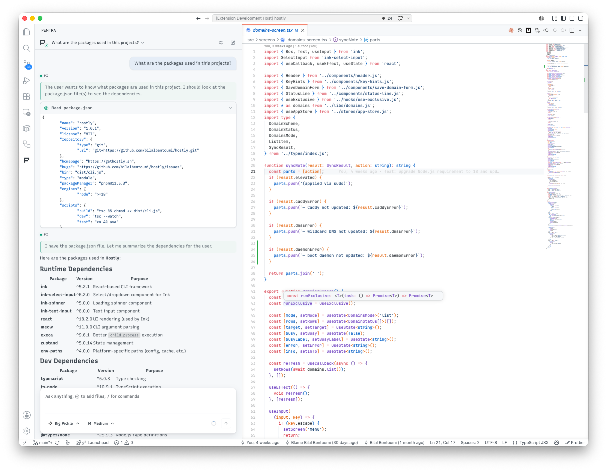

# Pintra

**AI coding agent for VS Code, powered by Pi.**

[github.com/bilalbentoumi/pi-vsc](https://github.com/bilalbentoumi/pi-vsc)

  
  
 
  
  

## Overview

Pintra brings the [Pi coding agent](https://www.npmjs.com/package/@earendil-works/pi-coding-agent) into VS Code and VSCodium as a focused chat sidebar. It spawns an external `pi` runtime and speaks its JSON-lines RPC protocol — streaming rich tool output and thinking, keeping session history and usage stats, and giving you model and reasoning controls, message forking, edit/write diffs, slash-command autocomplete, a full editor-tab chat, and HTML export.

The `pi` runtime is not bundled: install and authenticate it once, and Pintra drives it from inside the editor.

For more information, visit the [repository](https://github.com/bilalbentoumi/pi-vsc).

## Issues

Found a bug or have a feature request? Please open an issue on [GitHub](https://github.com/bilalbentoumi/pi-vsc/issues).

## License

Pintra is released under the MIT License. It embeds the MIT-licensed [`pi` coding agent](https://www.npmjs.com/package/@earendil-works/pi-coding-agent) through its documented RPC interface.
